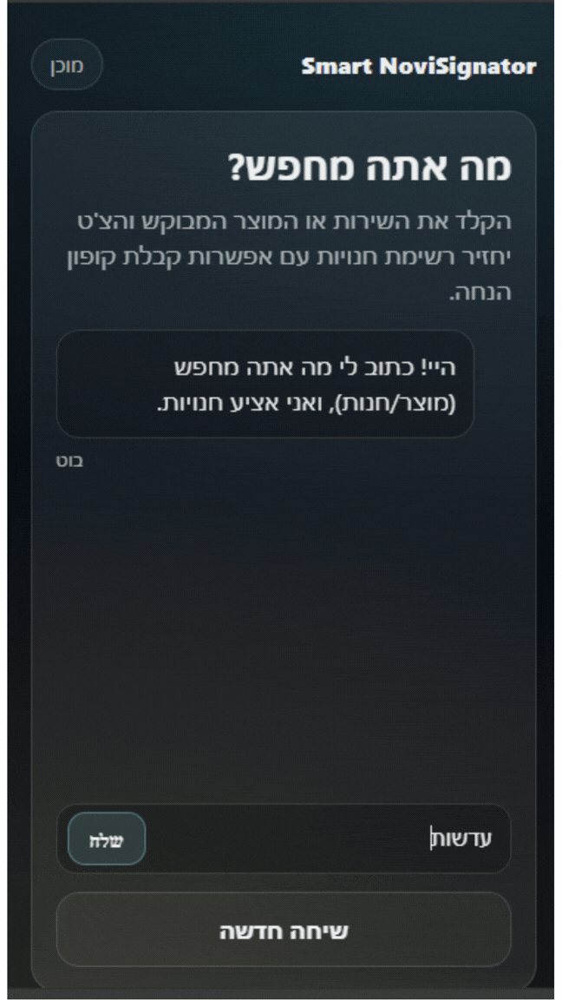

# Novisignator — Smart Mall Navigator  
**QR → Chat → Store → Coupon → Digital Signage**

> 🏆 **Hackathon Project**  
> Built as part of a digital signage hackathon in collaboration with **NoviSign**.  
> The project explores how static mall screens can become interactive by connecting
> QR-driven mobile chat flows with real-time signage updates.

---

## 🎬 App Flow (GIF)

  

Recorded during the NoviSign Hackathon — demonstrating the full end-to-end user flow.

---

## 💡 Problem

Digital signage in malls is typically a **one-way communication channel**:
screens show ads, but customers cannot easily act on intent  
(e.g. “I’m looking for shoes”) or receive personalized guidance.

---

## ✅ Solution

Novisignator turns digital signage into an **interactive entry point**:

- A mall screen continuously shows ads with a **static QR code**
- A shopper scans the QR code and opens a **mobile web chat**
- The shopper types a free-text request (product or service)
- The system returns **relevant store options**
- After selecting a store:
  - The user is offered a **coupon**
  - The mobile screen shows the coupon code
  - The signage screen is updated with the selected store’s content
  - A **navigation map image** is displayed to guide the user

---

## 🧱 Architecture Overview

### Frontend (Mobile Web)
- Static HTML / CSS / JavaScript
- Chat-based UI
- Clickable store options (chips)
- Coupon and navigation screens
- Optimized for mobile and RTL layouts

### Backend (Python)
- REST API for:
  - store and product lookup
  - free-text search
  - signage update triggers
- Clean separation between:
  - API layer
  - business logic
  - database access

### Database
- SQLite (MVP-oriented)
- Stores and products tables
- Designed for fast iteration during a hackathon

### Digital Signage Integration
- Hook for triggering content updates on NoviSign screens
- Designed to be replaceable or extended in production systems

---

## 🧰 Tech Stack

- **Python** (backend API)
- **SQLite** (database)
- **HTML / CSS / JavaScript** (mobile frontend)
- **GitHub** (version control & project presentation)

---
